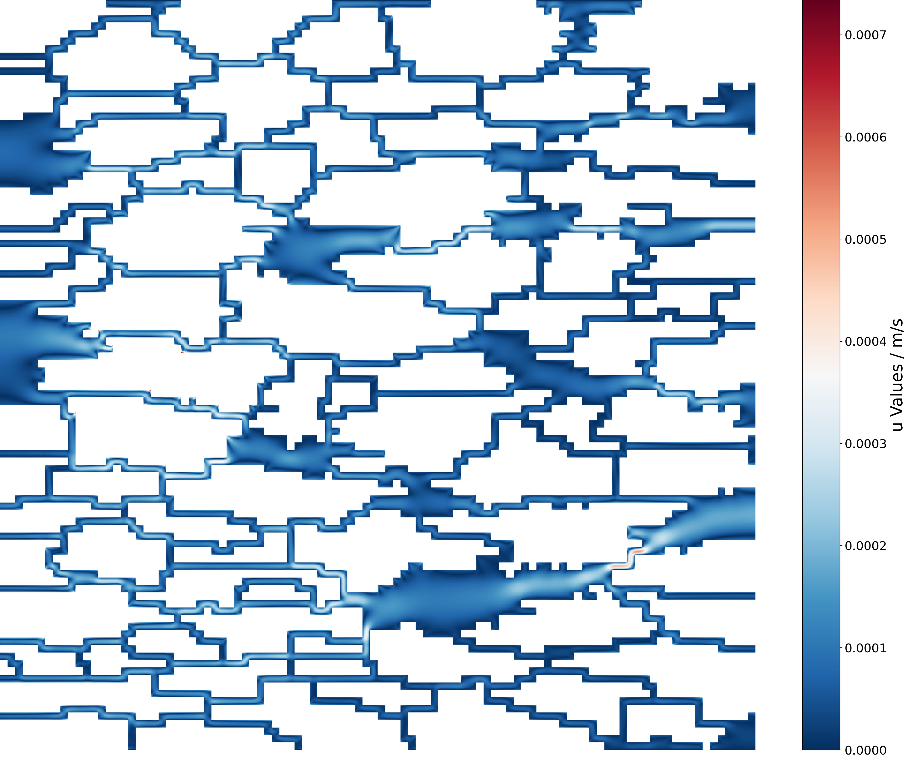
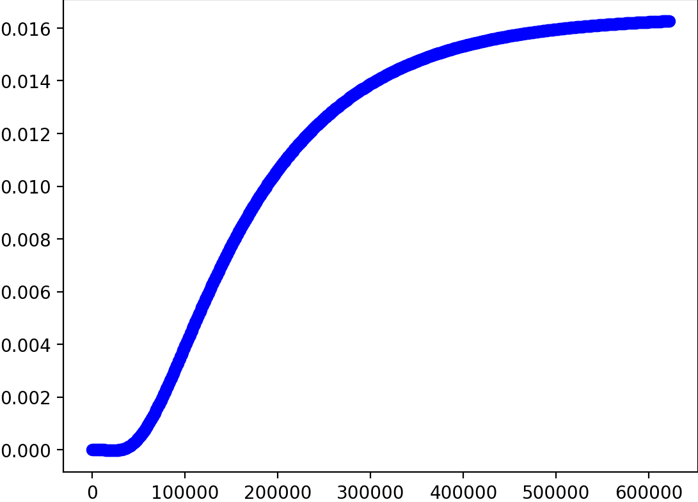

# Single-phase-LBM-for-gas-seepage-in-porous-media
This is a single-phase LBM code suitable for gas seepage in porous media

Reference code sources:
- https://github.com/jviquerat/lbm/workflows/lbm/badge.svg?branch=master
- https://github.com/Jeff-Hugh/GenPorMed.git

Add several functions based on the reference codes

## Contents
Cases implementations include:
- Couette flow (../app/huayi.py)
- Poiseuille flow (../app/poiseuille.py)
- Around circular cylinder flow (../app/turek.py)
- Variable cross-section slit flow (../app/step.py)

Something newly added:

- View LBM principle (unit.py)
- Influence of Knudsen number and gas property parameters (../app/knudsen.py)
- Complex porous media without slip effect (../app/porous.py & porous_1.py)
- Complex porous media with slip effect (../app/porous_kn.py)

## Code architecture
- Program entry (start.py & ../core/run.py)
- Case setting (../app)
- Grid import (../app/base_app.py)
- Solver (../core)
- Matrix algorithm (../core)
- Output (../plot/plot.py)
- Simple shape drawing (../utils)
- Complex pore structure generation

## How to run
1. Clone the repo
```shell
    git clone https://github.com/whupmcww/Single-phase-LBM-for-gas-seepage-in-porous-media.git
```

## Case explanation
Complex porous pressure and velocity cloud map
<p align="center">
      
</p>
