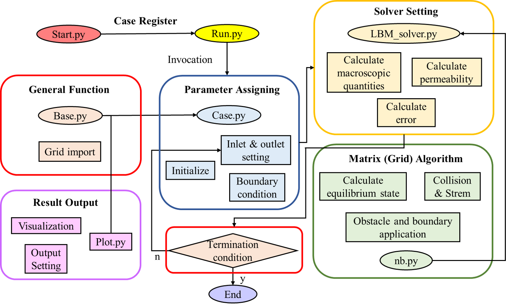
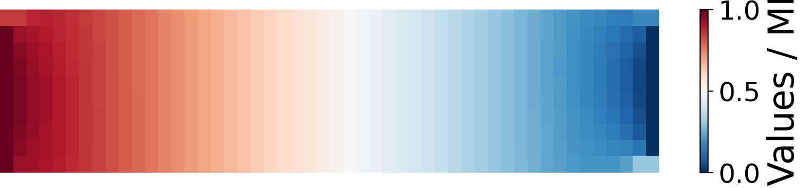
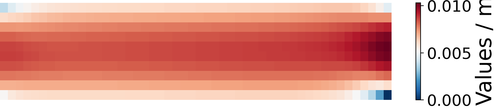
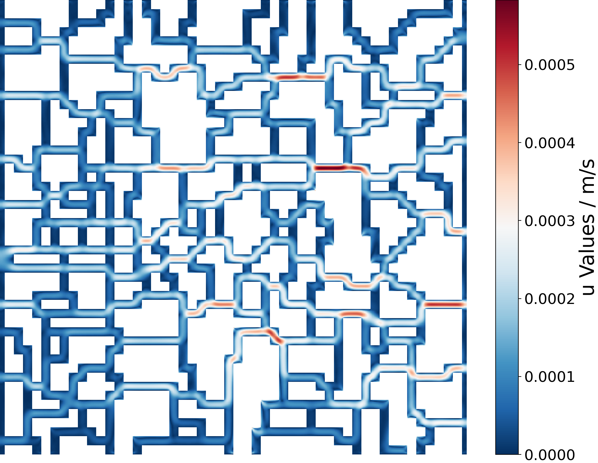
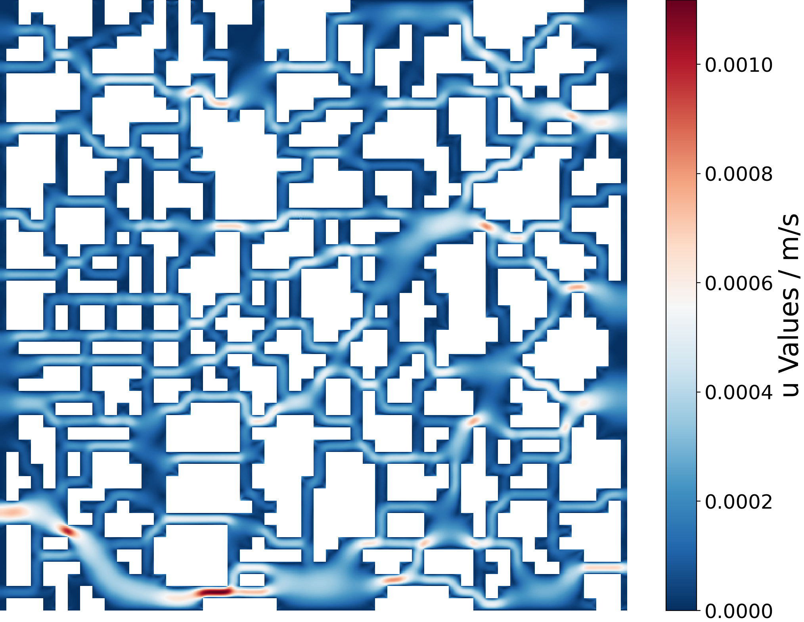
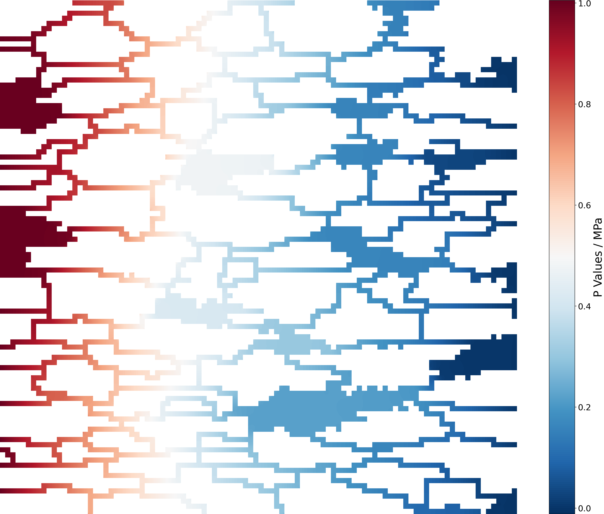
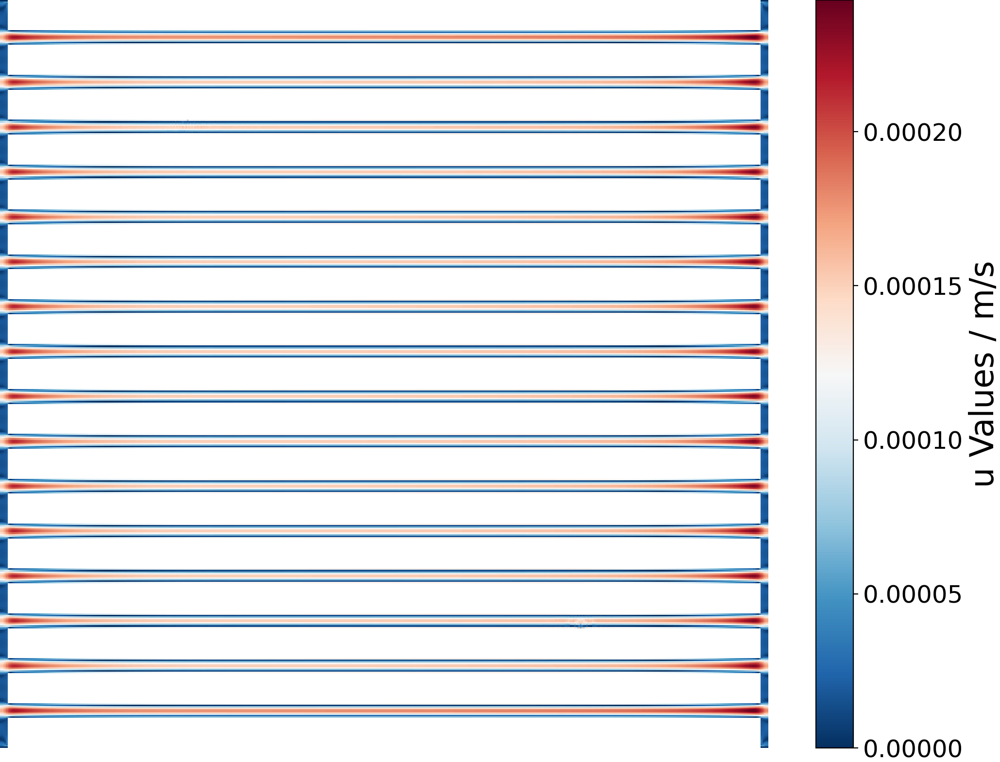
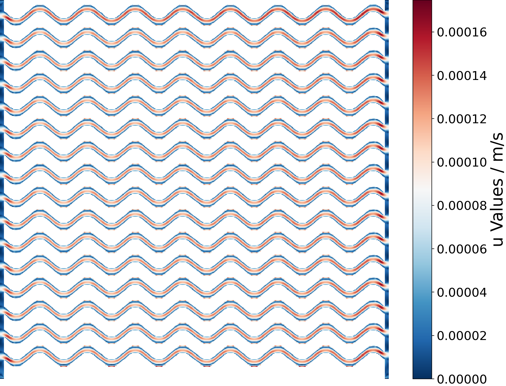

# Single-phase-LBM-for-gas-seepage-in-porous-media
This is a single-phase LBM code suitable for gas seepage in porous media

Fristly, we express our sincere gratitude and high respect to the reference authors. Reference code sources are as follows:
- https://github.com/jviquerat/lbm/workflows/lbm/badge.svg?branch=master
- https://github.com/Jeff-Hugh/GenPorMed.git

Our work is adding several functions based on the reference codes, ensuring that the codes meet our research objectives

## Contents
Cases implementations include:
- Couette flow (huayi.py)
- Poiseuille flow (poiseuille.py)
- Around circular cylinder flow (turek.py)
- Variable cross-section slit flow (step.py)

**Something newly added:**
- View LBM principle (unit.py)
- Influence of Knudsen number (knudsen.py)
- Influence of gas property parameters (porous_kn_He.py)
- Complex porous media without slip effect (porous.py, porous_1.py)
- Complex porous media with slip effect (porous_kn.py)
- Comparison with microfluidic experiments (porous_kn_1.py)

**Innovations**

1.We proposed an innovative method for obstacle placement and boundary condition configuration (lattice_obstacle_addForce.py, obstacle_ww.py)

 Main modifications include:
- __*add_obstacles_load*__ in **Base.py**
- __*add_obstacle_2*__ in **lattice_obstacle_addForce.py**
- __*nb_bounce_back_obstacle_kn_ww*__ in **nb_obstacle_addForce.py**

2.We studied the differences in permeability of various gases

 Main modifications include:
- __*init*__ in **porous_kn_He.py**
- __*ompute_lbm_parameters*__ in **porous_kn_He.py**
  
3.We employed the infection element method (in C++) and in-situ grid expansion (in Python), ensuring that the generated pore grids are suitable for LBM computations.

 Main modifications include:
- __*Generation*__ and __*InfectFluid*__ in **Porous2D.cpp**
- __*Expand_mesh*__ in **Expand_mesh.py**

4.The permeability algorithm was augmented to terminate when the permeability residual falls below the set threshold

 Main modifications include:
- __*outputs*__, __*judge_kError*__ and __*cacu_kError*__ in **Every_case.py** (such as porous_kn.py)
- __*check_stop*__ in **Base.py**
- __*cacu_k*__ in **lattice_obstacle_addForce.py**

5.Added several functions suitable for this research, such as special pore structure generation, microfluidic chip replication and output functions

 Main modifications include:
- **straight.py** and **wanqu.py** in folder **ts_gen**
- **Fig_chuli.py** and **Fig_read.py** in folder **mfchip_rep**
- __*export_g*__, __*export_poro_flux*__ and __*export_k_as_csv*__ in **plot.py**

## Code architecture
- Program entry (start.py, run.py)
- Case setting (../app)
- Grid import (base_app.py)
- Solver (../core)
- Matrix algorithm (../core)
- Output (plot.py)
- Simple shape drawing (../utils)
- Complex pore structure generation (test_gen, ts_gen)
- Microfluidic experimental grid replication (mfchip_rep)

The following figure shows the code framework more clearly

<p align="center">
    
</p>

## How to run LBM simulation
1. Clone the repo
```shell
    git clone https://github.com/whupmcww/Single-phase-LBM-for-gas-seepage-in-porous-media.git
```

2. Select which case you want to use. Take case porous.py as example, set parameters for your case. Specify the grid file path if available
```shell
    class porous(base_app):
    def __init__(self):
        ...
        # Set parameters for YourCase
        self.name     = 'porous'
        self.L_real   = 1.0e-2
        self.L_lbm    = 1000

        # Obstacles
        self.filepath = 'path to your grid file'
        self.filename = self.filepath +'YourGridfile.txt'
        self.obstacle_ww =  obstacle('users_define')
        ...
```

3. Modify the case name in the start.py
```shell
    if __name__ == '__main__':
        ...
        # Instanciate app
        app = app_factory.create('porous')
        ...
```

4. Run the file by IDLE F5 or Powershell command. View the result file output in the specified folder
```shell
    python start.py
```

## How to generate porous grid by QSGS
1. Use code in **test_gen**
2. Set the generation mode and QSGS parameters in run.cpp
```shell
    ...
    void Generate2D()
    {
        const int M = 50;
	    const int N = 50;
	    const double phi = 0.371;			/// target porosity
	    const double p_cd = 0.05;		/// core distribution probability
        ...
        Porous2D porous(M, N, phi, p_cd, z_h, z_v, f);
        ...
        char filename[100] = "./output/Grid.txt";
	    porous.output2datatxt(M, N, s, filename);
    }
    ...
```
3. Compile code using Cmake and run, you can put these command in a .bat (Windows) or .sh (Ubuntu) file
```shell
    cmake ./
    make
    ./run
```

For more details about QSGS, please refer to https://github.com/Jeff-Hugh/GenPorMed.git

## Case explanation
Conventional LBM testing, such as Couette flow, Poiseuille flow, etc., please refer to https://github.com/jviquerat/lbm/workflows/lbm/badge.svg?branch=master

Here we will focus on the unique aspect of our work, which is about the slip effects of gas seepage in porous media

### Testing the effect of Knudsen number on permeability
Use single channel grid (rectangular)
Set different Knudsen numbers in file **knudsen.py**
```shell
	class knudsen(base_app):
    def __init__(self):
		...
		self.k_n    	= 1e-5
		...
```

By analyzing the variation of cross-sectional velocity of flow channel with Knudsen number, it can be obtained

<p align="center">
    
</p>

### Testing the influence of gas properties on permeability
Use single channel grid (rectangular)
Modify parameters for different gas in file **porous_kn_He.py**
```shell
	class porous_kn_He(base_app):
    def __init__(self):
		...
        #Hydrogen
        self.rho_real   = 0.08988
        self.nu_real    = 1.06e-4
        self.m_gas      = 3.35E-27
        self.d_gas      = 0.29E-9
        self.Tc 		= 33.18
        self.pc 		= 1.315e6
        self.omega 		= -0.128
		...
```

Output pressure and velocity cloud map

<p align="center">
     
</p>

By statistically analyzing the permeability data of different gases at different channel sizes, it can be obtained

<p align="center">
    
</p>

### Testing the permeability of complex porous media
Generate grid files (.txt) for testing using codes in **test_gen** & **ts_gen**

<p align="center">
     
</p>

Pressure, velocity cloud map and permeability can be output over time

<p align="center">
     
</p>

You can analyze the influence of pore structure parameters on permeability, such as
**Porosity**

<p align="center">
      
</p>

**Directionality**

<p align="center">
     
</p>

**Tortuosity**

<p align="center">
      
</p>

### Comparison with microfluidic experiment
By binary processing of microfluidic chip images and manual editing if needed, it can be obtained

<p align="center">
     
</p>

During the calculation process, the flow field morphology and permeability gradually stabilize

<p align="center">
     
</p>
